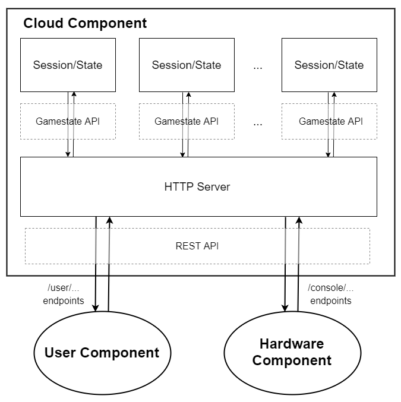

# CPEN 391 Project - Cloud Component Prototype Report

## A. Individual Identification

| Name | Student Number | Lab Section |
| ----- | ----- | ----- |
| Hansen Dan | 84620178 | L2B |

---

## B. Component Description

This is the **Cloud** component of the project.

Within the context of our project, the cloud component takes on the role of the game server, interfacing with both the user component, to handle user inputs to the game, and with the hardware component, to facilitate display of graphics on the monitor.

This component satisfies the course requirements for the Cloud component by being a back-end server and communicating with the DE1-SoC over the internet with HTTP requests/responses.

---

## C. Requirements and Objectives

### Requirements

| Feature | Requirements |
| --- | --- |
| Session Management | The server must manage independent lobby *sessions*, which are independent instances of the game each linked to one DE1-SoC, allowing DE1-SoCs to register/unregister sessions and users to join/leave sessions at will.   **Additional Requirements:** <ul> <li> Number of Sessions: the number of sessions is more likely to be limited by the number of DE1-SoCs available rather than the server itself, so we will fix the maximum number of sessions to support at **4**. </li> <li> Number of Players per Session: If the number of players is too high, the playing field will feel cramped and too small. The maximum number of players will be fixed at **4**. </li> </ul> |
| Game Logic Calculations | When the game is ongoing within a session, the server must perform the calculations for maintaining the game state (collision, movement, damage, etc.). It is important that the resulting implementation of these calculations be as efficient and optimized as possible, to facilitate good performance and a positive gameplay experience. |
| API Service | The cloud component is must provide an API (defined further in the [Intercomponent REST API Specification](#appendix-1---intercomponent-rest-api-specification)) callable by the other components, that exposes the above functionality to other components. |

### Essential and Risky Features

Session Management is not strictly necessary for this system. Dropping this feature, however, would mean only supporting a single DE1-SoC and thus being limited to one lobby. While this would satisfy our initial objective to build a functioning game, the ability to support multiple DE1-SoCs and multiple games running in parallel with one server would greatly increase the scalability of the design and enhance its appeal towards the target market. Thus, we have judged that the Session Management feature is well worth the added design complexity and accompanying risk.

On the other hand, Game Logic Calculations and the API Service are both essential features that the Cloud component must provide for our design to be feasible. If the server cannot support a changing, dynamic game state, then it will have failed in the objective of providing an interactive game to users. The API Service is how the Cloud component interacts with the other components and is thus necessary to meet the course requirement for a communication pathway between this component and the DE1-SoC.

---

## D. Learning and Alternatives

The most important design consideration for the technologies and implementation design was development time. A complete rewrite of our project proposal meant that principal development could not begin until the weekend leading up to the week of February 13-17. The presence of 4 midterms on that week, in addition to the project work, severely limited the amount of time available to spend on development. Thus, familiar technologies or technologies that were conducive to rapid development were more favourable, hence the resulting choice to use Python and Flask to serve an HTTP server to provide a REST API.

### Alternative Technologies

- UDP instead of TCP
  - The traffic intensity on the network will not be that high, even with multiple concurrent games ongoing. TCP's guaranteed data delivery means no missed user inputs and a better gameplay experience, which is worth the increased overhead. Thus, we are committed to using an application layer protocol that runs over TCP.
- Alternate Application-layer Protocol: Custom protocol over persistent TCP connections, or WebSockets
  - Pros: By ditching the client-server model, other components do not need to poll the server for the latest information. Instead, server can push updates to user/hardware components as things happen. This has the potential to reduce network traffic intensity.
  - Cons: slower implementation, increased complexity. A large portion of the current implementation will need to be redesigned from the ground up. Need to define packet protocol, handle multithreading and work with bytes on both the server and client sides.
  - This alternate design is still viable and in place as a backup plan. The principal goal of integration testing for the Cloud component is to discover if the client-server model is efficient enough for our needs. If the current server design architecture is too inefficient, we will switch to this. There is also the possibility that only the gameplay endpoints need to be replaced and the rest of the server can be retained as is. This will be investigated further.
- Connexion library
  - Pros: This library allows generating the server directly from API specification. This reduces boilerplate code, takes advantage of existing resources (API spec), and greatly reduces the design complexity and risk.
  - Cons: time taken to learn new library and refactor implementation to use it.
  - If integration testing reveals that the client-server model is sufficient, we will investigate using this library.

### Alternative Implementation Design

- Generalised User ID: currently, the user id cookie is just the `session_id` appended with their player number in that session.
  - Pros: Dead simple. It is also very easy to spoof different players' cookies for demo purposes, which was very useful during the Module 2 Demo.
  - Cons: This is not suitable for the final product. If users misbehave and don't delete their cookies when we ask them to, things will go wrong. Furthermore, this design pushes additional complexity onto the Session layer by giving it the responsibility to handle user IDs. This functionality would be better off spread across the other layers (see [section E](#e-prototype-design)).
  - If integration testing reveals that the client-server model is sufficient, then we for Module 3 we will replace the current cookie format with a generalised unique user id. The unique user ids will be tracked and translated in the Session Multiplexer layer, allowing us to move the brunt of the logic for user join/leave functionality to this layer as well.

---

## E. Prototype Design

This section describes the component prototype design as it was at the time of the Module 2 Demo.

### Design Components

To understand the structure of the prototype design, we will follow the path an HTTP request would take through the system.

The first component that would be encountered is the **HTTP server**, the primary component of the design. Responsible for serving the endpoints that are called by other components, the HTTP server processes requests and sends responses according to the [Intercomponent **REST API**](#appendix-1---intercomponent-rest-api-specification). Paths for the user component begin with `/user` while paths for the hardware component begin with `/console`. When fielding requests, the HTTP server is responsible for extracting parameters and cookies - most notably, it must obtain the `session_id` and `user_id` of a request so that the server knows which user of which session is issuing the request.

The **SessionMultiplexer**, a submodule of the HTTP server, is responsible for taking maintaining the sessions of a server and routing requests to the correct session. Once an HTTP endpoint has extracted the `session_id` and `user_id`, it will pass this information, along with the requested action, to its SessionMultiplexer. The SessionMultiplexer verifies that the `session_id` is associated with a valid session, and if so, passes on the request to it via the **Gamestate API**.

Finally, the request is processed by an individual **Session**. Each Session object is responsible for maintaining the game state of one session/game. It tracks the position of every entity on the field, the health of each player, schedules explosions, and records the rankings of the players as the game progresses. The request may ask to move or place an entity on the field, and the Session object makes the appropriate changes and changes the internal representation of the game state accordingly.

After the request makes it to the correct Session object, the Session may return some information back to the HTTP server through the SessionMultiplexer. The HTTP server will then send the appropriate HTTP response.

---

## F. References / Acknowledgements / Appendices

### References

- [OpenAPI Specification](https://spec.openapis.org/oas/v3.1.0), for specifying the Intercomponent REST API
- [Flask](https://palletsprojects.com/p/flask/), framework used for the HTTP server
- [WSGIserver](https://pypi.org/project/WSGIserver/), the WSGI-compatible server used to deploy the Flask app in production

### Appendix 1 - Intercomponent REST API Specification

The specification is located in `.../l2b-26-w/cloud/design_docs/openapi_spec.yml` and is written to comform to the OpenAPI Specification. It is recommended to view that file using an OAS editor like Swagger. It has also been reproduced below, starting on the following page.
